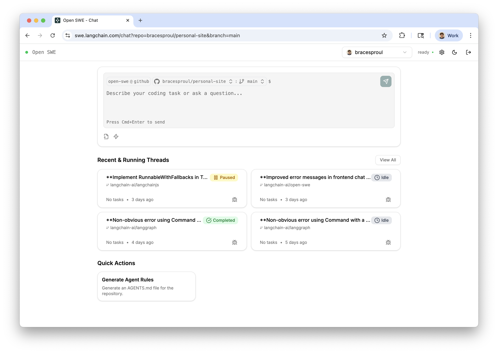

  <picture>
    <source media="(prefers-color-scheme: dark)" srcset="apps/docs/logo/dark.svg">
    <source media="(prefers-color-scheme: light)" srcset="apps/docs/logo/light.svg">
    
  </picture>

Open SWE is an open-source cloud based coding agent. It's built with [LangGraph](https://langchain-ai.github.io/langgraphjs/), and is designed to autonomously understand, plan, and execute code changes across entire repositories.

Think of Open SWE as your own personal engineer who can handle complex tasks end to end, from planning to execution, to opening a pull request.

> [!WARNING]
> Open SWE is under active development and is not yet ready for production use.

> [!TIP]
> Try out Open SWE yourself using our [public demo](https://swe.langchain.com)!
>
> **Note: you're required to set your own LLM API keys to use the demo.**

# Features

- 📝 **Planning**: Open SWE has a dedicated planning step which allows it to deeply understand complex codebases and nuanced tasks. You're also given the ability to accept, edit, or reject the proposed plan before it's executed.
- 🤝 **Human in the loop**: With Open SWE, you can send it messages while it's running (both during the planning and execution steps). This allows for giving real time feedback and instructions without having to interrupt the process.
- 🏃 **Parallel Execution**: You can run as many Open SWE tasks as you want in parallel! Since it runs in a sandbox environment in the cloud, you're not limited by the number of tasks you can run at once.
- 🧑‍💻 **End to end task management**: Open SWE will automatically create GitHub issues for tasks, and create pull requests which will close the issue when implementation is complete.

## Usage

Open SWE can be used in multiple ways:

- 🖥️ **From the UI**. You can create, manage and execute Open SWE tasks from the [web application](https://swe.langchain.com). See the ['From the UI' page](https://docs.langchain.com/labs/swe/usage/ui) in the docs for more information.
- 📝 **From GitHub**. You can start Open SWE tasks directly from GitHub issues simply by adding a label `open-swe`, or `open-swe-auto` (adding `-auto` will cause Open SWE to automatically accept the plan, requiring no intervention from you). See the ['From GitHub' page](https://docs.langchain.com/labs/swe/usage/github) in the docs for more information.

# Documentation

To get started using Open SWE locally, see the [documentation here](https://docs.langchain.com/labs/swe/).
